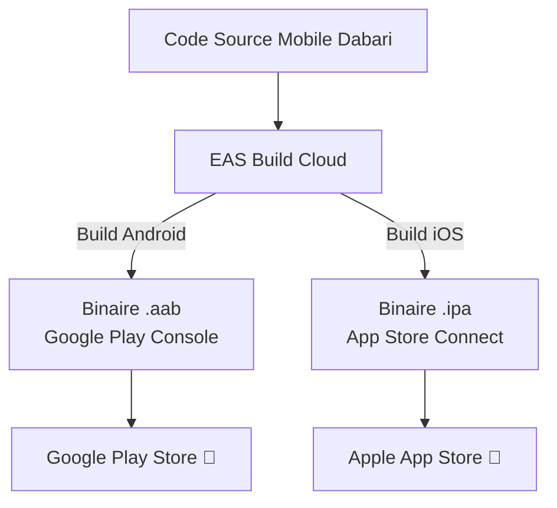

# 🚀 Guide Ultime : Déploiement & Publication de Dabari de A à Z sur Google Play Store & Apple App Store

> **Guide complet pas-à-pas pour publier l'application mobile Dabari en partant de zéro (sans compte préalable).**  
> **Application :** Dabari (Africonnect)  
> **Technologies :** React Native / Expo SDK 54, TypeScript, EAS Build Cloud.

---

## 📑 Table des Matières
1. [Vue d'Ensemble & Coûts des Plateformes](#1-vue-densemble--coûts-des-plateformes)
2. [Phase 1 : Création de Tous les Comptes Requis](#phase-1--création-de-tous-les-comptes-requis)
   * [1.1. Créer un Compte Expo (Gratuit)](#11-créer-un-compte-expo-gratuit)
   * [1.2. Créer un Compte Développeur Google Play ($25 unique)](#12-créer-un-compte-développeur-google-play-25-unique)
   * [1.3. Créer un Compte Développeur Apple ($99/an)](#13-créer-un-compte-développeur-apple-99an)
3. [Phase 2 : Configuration Locale & Outils CLI](#phase-2--configuration-locale--outils-cli)
4. [Phase 3 : Compilation des Binaires dans le Cloud (EAS Build)](#phase-3--compilation-des-binaires-dans-le-cloud-eas-build)
5. [Phase 4 : Publication sur Google Play Store (Android)](#phase-4--publication-sur-google-play-store-android)
6. [Phase 5 : Publication sur Apple App Store (iOS)](#phase-5--publication-sur-apple-app-store-ios)
7. [Phase 6 : Mises à Jour Post-Lancement](#phase-6--mises-à-jour-post-lancement)
8. [Tableau Récapitulatif : Coûts, Liens & Délais](#tableau-récapitulatif--coûts-liens--délais)

---

## 1. Vue d'Ensemble & Coûts des Plateformes

Pour publier une application mobile sur les deux stores officiels, il faut produire deux fichiers finaux :
* **Pour Android (Google Play)** : un fichier **`.aab`** (*Android App Bundle*).
* **Pour iOS (App Store)** : un fichier **`.ipa`** (*iOS App Store Package* signé numériquement par Apple).

Grâce à **EAS Build (Expo Application Services)**, **vous n'avez pas besoin d'un ordinateur Mac** pour compiler la version iOS : tout est compilé sur des serveurs distants dans le Cloud.



---

## Phase 1 : Création de Tous les Comptes Requis

### 1.1. Créer un Compte Expo (Gratuit)
Le compte Expo est indispensable pour faire compiler vos applications dans le cloud et gérer les certificats de signature.

1. Rendez-vous sur [expo.dev/signup](https://expo.dev/signup).
2. Renseignez votre adresse e-mail, un nom d'utilisateur (ex: `dabari-app` ou votre pseudo) et un mot de passe.
3. Validez votre adresse e-mail en cliquant sur le lien reçu.

---

### 1.2. Créer un Compte Développeur Google Play ($25 unique)
Le compte développeur Google permet de publier des applications sur le **Google Play Store**.

1. Rendez-vous sur [play.google.com/console/signup](https://play.google.com/console/signup).
2. Connectez-vous avec votre compte Google (Gmail professionnel recommandé).
3. Choisissez le type de compte :
   * **Personnel :** Plus simple si vous êtes indépendant (nécessite une pièce d'identité).
   * **Organisation :** Si vous avez une entreprise enregistrée (nécessite le numéro SIREN/D-U-N-S).
4. Payez les frais d'inscription uniques de **25 $ USD** par carte bancaire.
5. Complétez la **vérification d'identité** (téléversement d'une pièce d'identité et justificatif de domicile). La validation prend généralement entre 24h et 48h.

---

### 1.3. Créer un Compte Développeur Apple ($99/an)
Le compte Apple Developer Program permet de publier sur l'**App Store** et d'utiliser **TestFlight**.

1. Rendez-vous sur [developer.apple.com/programs/enroll/](https://developer.apple.com/programs/enroll/).
2. Connectez-vous avec votre **Identifiant Apple (Apple ID)** (l'authentification à deux facteurs doit être activée).
3. Téléchargez l'application **Apple Developer** sur votre iPhone (méthode la plus rapide) ou complétez le formulaire sur le web.
4. Choisissez votre type d'inscription :
   * **Individuel (Individual) :** L'application sera publiée sous votre nom propre (ex: *"Prénom Nom"*).
   * **Organisation (Company) :** L'application sera publiée sous le nom de l'entreprise (ex: *"Dabari SAS"*). *Nécessite un numéro D-U-N-S gratuit auprès de Dun & Bradstreet.*
5. Payez l'abonnement annuel de **99 $ USD** (environ 99 € / an).
6. Apple valide votre compte sous 24 à 48 heures ouvrées.

---

## Phase 2 : Configuration Locale & Outils CLI

### Étape 2.1 : Installer l'outil Expo CLI sur votre ordinateur
Ouvrez votre terminal (PowerShell sur Windows ou Terminal sur macOS/Linux) :

```bash
npm install -g eas-cli
```

Vérifiez que l'outil est bien installé :
```bash
eas --version
```

### Étape 2.2 : Vous connecter à votre compte Expo
```bash
cd mobile
eas login
```

### Étape 2.3 : Vérifier la configuration des fichiers du projet
Le projet Dabari est déjà préconfiguré avec :
* **[`mobile/app.json`](file:///c:/Users/Mirac/Desktop/stage/africonnect/mobile/app.json)** : Contient les identifiants uniques `com.dabari.app`, le logo, le splash screen et les permissions caméra/photos.
* **[`mobile/eas.json`](file:///c:/Users/Mirac/Desktop/stage/africonnect/mobile/eas.json)** : Contient les règles de compilation de production avec l'API en ligne `https://dabari-api.up.railway.app/api`.

---

## Phase 3 : Compilation des Binaires dans le Cloud (EAS Build)

### Étape 3.1 : Compiler pour Android (Google Play)

Exécutez dans votre terminal :

```bash
cd mobile
eas build --platform android --profile production
```

* **Ce qui se passe :**
  1. EAS vous demande : *"Would you like to generate a new Android Keystore?"* ➔ Répondez **Yes** (EAS va créer et conserver vos clés de signature sécurisées pour toujours).
  2. Le code est envoyé sur les serveurs d'Expo.
  3. Après 5 à 10 minutes, la compilation se termine et un lien s'affiche dans votre terminal.
  4. Téléchargez le fichier **`.aab`** généré (ex: `dabari-1.0.0.aab`).

---

### Étape 3.2 : Compiler pour iOS (Apple App Store)

Exécutez dans votre terminal :

```bash
cd mobile
eas build --platform ios --profile production
```

* **Ce qui se passe :**
  1. EAS vous demande de vous connecter à votre compte **Apple Developer** (saisir votre identifiant Apple et mot de passe spécifique d'application).
  2. EAS génère automatiquement pour vous le **Certificat de Distribution Apple** et le **Profil de Provisionnement**.
  3. La compilation tourne sur une machine macOS dans le cloud d'Expo.
  4. En fin de build, un lien de téléchargement du fichier **`.ipa`** est fourni.

---

## Phase 4 : Publication sur Google Play Store (Android)

Rendez-vous sur [play.google.com/console](https://play.google.com/console).

### Étape 4.1 : Créer l'application
1. Cliquez sur **Créer une application**.
2. **Nom de l'application :** `Dabari`.
3. **Langue par défaut :** Français (France).
4. **Type :** Application (Gratuite).
5. Acceptez les déclarations et validez.

---

### Étape 4.2 : Compléter la Fiche Principale du Store
Dans le menu de gauche ➔ **Présence sur le Play Store** ➔ **Fiche principale du Store** :
* **Description courte (80 caractères max) :**  
  *Plats africains faits maison, devis traiteur & envois de colis GP sécurisés.*
* **Description complète :**  
  *Dabari est la plateforme de mise en relation de confiance dédiée à la diaspora et aux amoureux de gastronomie africaine. Commandez des plats traditionnels faits maison, demandez des devis traiteur pour vos cérémonies et événements, ou organisez vos envois de colis (GP) en toute sérénité entre l'Europe et l'Afrique.*
* **Ressources graphiques :**
  * **Icône de l'application :** 512 x 512 px (format PNG 32-bit sans transparence).
  * **Graphique de promotion (Bannière) :** 1024 x 500 px.
  * **Captures d'écran smartphone :** Au minimum 4 captures d'écran (ex: Accueil, Traiteur, Commande de devis, Espace GP Colis).

---

### Étape 4.3 : Compléter la section "Contenu de l'application"
Remplir les formulaires obligatoires dans le menu de gauche :
1. **Politique de confidentialité :** Renseigner l'URL de votre politique (ex: `https://dabari.fr/politique-confidentialite`).
2. **Accès aux fonctionnalités (Identifiants de test) :** Indiquer les identifiants de démonstration pour les réviseurs Google (ex: `demo@dabari.fr` / `MotDePasse123!`).
3. **Annonces :** Déclarer *"Non, mon application ne contient pas d'annonces"*.
4. **Classification du contenu :** Remplir le questionnaire d'âge (sélectionner utilitaire / commerce).
5. **Public cible :** 18 ans et plus.
6. **Sécurité des données (*Data Safety*) :** Déclarer les données collectées (Email, Nom, Téléphone, Photos) à des fins de fonctionnement de l'application et chiffrées en transit via HTTPS.

---

### Étape 4.4 : Téléverser le binaire `.aab` et publier
1. Dans le menu de gauche ➔ **Production** (ou **Test fermé** selon le type de compte).
2. Cliquez sur **Créer une version**.
3. Glissez-déposez le fichier **`.aab`** téléchargé à l'étape 3.1.
4. Donnez un nom à la version (ex: `1.0.0`) et écrivez les notes de version : *"Lancement officiel de l'application Dabari !"*.
5. Cliquez sur **Enregistrer** ➔ **Vérifier la version** ➔ **Démarrer le déploiement en production**.

---

## Phase 5 : Publication sur Apple App Store (iOS)

Rendez-vous sur [appstoreconnect.apple.com](https://appstoreconnect.apple.com).

### Étape 5.1 : Créer la fiche de l'App
1. Allez dans **Mes apps** ➔ Cliquez sur **"+"** ➔ **Nouvelle app**.
2. **Plateforme :** iOS.
3. **Nom :** `Dabari`.
4. **Langue principale :** Français.
5. **ID de lot (Bundle ID) :** Sélectionnez `com.dabari.app`.
6. **SKU :** `dabari-ios-production`.
7. **Accès utilisateur :** Accès complet.

---

### Étape 5.2 : Envoyer le binaire iOS vers App Store Connect
Vous pouvez envoyer directement le build depuis votre terminal avec la commande EAS :

```bash
cd mobile
eas submit --platform ios
```
*Le binaire `.ipa` est automatiquement injecté dans votre compte App Store Connect.*

---

### Étape 5.3 : Renseigner les informations du Store
Sur la page de votre application dans App Store Connect :
1. **Captures d'écran obligatoires :**
   * Format **iPhone 6.5 pouces** (1290 x 2796 px ou 1242 x 2688 px) : 3 à 5 captures.
   * Format **iPhone 5.5 pouces** (1242 x 2208 px) : 3 à 5 captures.
2. **Texte promotionnel & Description :** Mêmes textes que pour Google Play.
3. **Mots-clés (*Keywords*) :** `traiteur, africain, cuisine africaine, gp, colis, transport bagages, dabari`.
4. **URL de support :** `https://dabari.fr/contact` ou adresse email de contact.
5. **URL de la politique de confidentialité :** `https://dabari.fr/politique-confidentialite`.

---

### Étape 5.4 : Informations pour la Vérification Apple (*App Review*)
> [!IMPORTANT]
> Apple teste systématiquement chaque application manuellement.
1. Cochez **"Connexion requise"**.
2. Renseignez l'identifiant et mot de passe de test (ex: `demo@dabari.fr` / `MotDePasse123!`).
3. Dans les notes pour l'équipe de vérification : *"Application de mise en relation traiteurs et transporteurs de colis GP. Utilisez les identifiants de test pour naviguer dans l'application."*
4. **Conformité du chiffrement (*Export Compliance*) :** À la question sur l'utilisation du chiffrement, répondez **OUI** (car HTTPS est utilisé), puis cochez la case d'exemption standard.

---

### Étape 5.5 : Soumission Finale
1. Dans la section **Build**, sélectionnez la version téléversée par EAS.
2. Cliquez sur **Enregistrer** en haut à droite.
3. Cliquez sur **Ajouter pour vérification** ➔ **Envoyer à l'équipe de vérification de l'App Store**.

---

## Phase 6 : Mises à Jour Post-Lancement

Une fois votre application en ligne, vous aurez 2 façons de la mettre à jour :

### Méthode 1 : Mises à Jour Instantanées (EAS Update)
Pour corriger une faute de frappe, modifier un style de couleur ou corriger un bug JavaScript sans attendre la validation d'Apple/Google :

```bash
# Publie la mise à jour instantanément sur tous les téléphones des utilisateurs
cd mobile
eas update --channel production --message "Correction mineure affichage"
```

### Méthode 2 : Mises à Jour Majeures (Nouvelle Version Store)
Si vous ajoutez une nouvelle permission native ou un nouveau module Expo :
1. Modifiez `"version": "1.0.1"` dans [`mobile/app.json`](file:///c:/Users/Mirac/Desktop/stage/africonnect/mobile/app.json).
2. Relancez :
   ```bash
   cd mobile
   eas build --platform all --profile production
   ```
3. Téléversez les nouveaux binaires sur vos consoles respectives.

---

## Tableau Récapitulatif : Coûts, Liens & Délais

| Plateforme | Tarif | Délai de validation | Lien d'accès |
| :--- | :--- | :--- | :--- |
| **Expo (EAS)** | **Gratuit** (Formule standard) | Immédiat | [expo.dev](https://expo.dev) |
| **Google Play Store** | **25 $ USD** (Paiement unique à vie) | **2 à 4 jours** | [play.google.com/console](https://play.google.com/console) |
| **Apple App Store** | **99 $ USD / an** (Abonnement annuel) | **24 à 48 heures** | [appstoreconnect.apple.com](https://appstoreconnect.apple.com) |

---

*Guide officiel de production pour le projet Dabari Mobile.*
